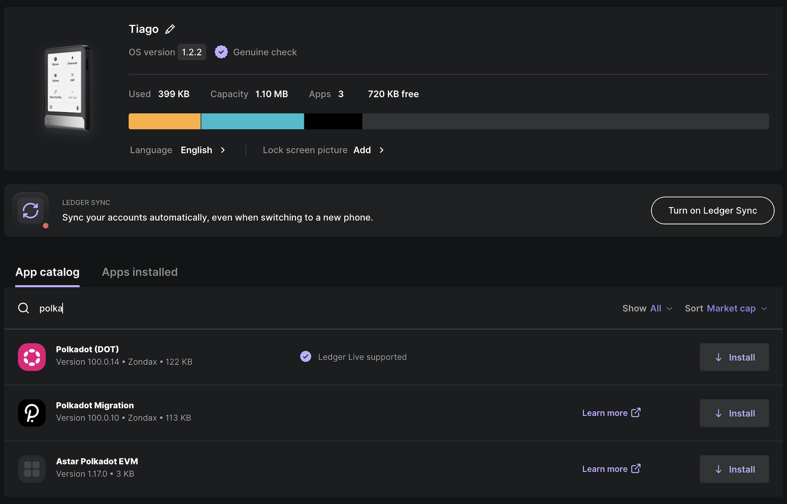
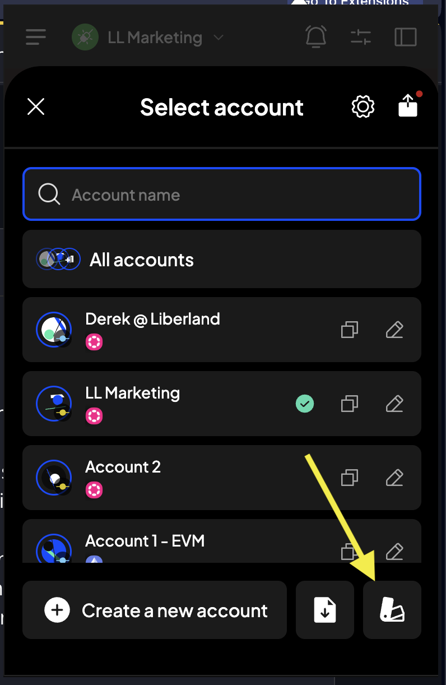

# Using Ledger Hardware Wallets

You should have an up-to-date ledger with the Polkadot app installed on your Ledger device.

To set up your Ledger and connect to Liberland Blockchain on desktop/laptop:

- Connect your Ledger to your desktop/laptop
- If needed, install the Polkadot app
	- Launch Ledger Live
	- Open 'My Ledger'
	- Unlock your Ledger
	- Search the App Catalog for 'Polkadot', select 'Install'

- In Ledger Live, open 'Apps Installed'
- Select 'Add Account' beside 'Polkadot (DOT)'
- Confirm on your Ledger you want to open the Polkadot app
	- If prompted, confirm your Ledger device can connect to your computer
- In Ledger Live, name your new Polkadot account, select 'Add account'
- After the account is added, select 'Done'
- Visit https://blockchain.liberland.org in your browser
- Connect a supported browser extension to your Ledger
	- e.g. How to connect Ledger device to Subwallet
		- Open SubWallet browser extension
		- Select the current account name
		- Select the hardware icon at the bottom
		- Select 'Connect a Ledger device'
		- Unlock your Ledger
		- Approve connecting to your Ledger
		- In the browser, select 'Connect Ledger device'
		- Select the wallet address to connect, then select 'Connect Ledger device'

- Refresh https://blockchain.liberland.org in your browser
- Select the wallet name, your selected Ledger wallet should appear in the list of available wallets
- Select your Ledger wallet from the list, continue using Liberland Blockchain Wallet normally

This will enable the ability to sign/confirmt transactions on any Substrate/Polkadot-based chain, including Liberland Blockchain, as long as the Polkadot app is open on your Ledger device.

If you wish to migrate your previously existing account onto a ledger one, visit the [migration guide](./account-migration.md).
